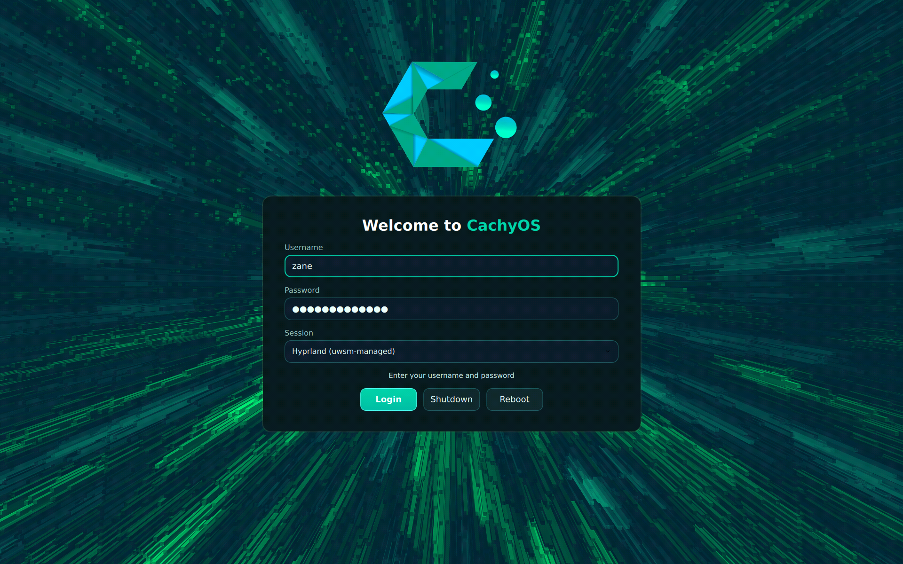

Cachyos Theme for SDDM
------------------------

SDDM is a Login Manager for Linux which can be themed by qml. This is a port of existing kdm themes (package archlinux-themes-kdm) to SDDM.
Rebranded to CachyOS.

The Theme is available on AUR:
`# paru -S cachyos-sddm-emerald`

Manual Installation
-------------------
* copy the folder (cachyos-emerald) to /usr/share/apps/sddm/themes/
* change CurrentTheme to cachyos-emerald
* Have fun!

This project is based on the original theme by Thayer Williams.
-------------------
Original work:
Thayer Williams
http://cinderwick.ca/

Ported to SDDM by:
Guidobelix

Rebranded for CachyOS by:
StarterX4

Further modifications and rework by:
Zane Fernandes
zane.ferns360@gmail.com

Licensed under the Creative Commons Attribution-ShareAlike 3.0 License (CC BY-SA 3.0):
https://creativecommons.org/licenses/by-sa/3.0/
